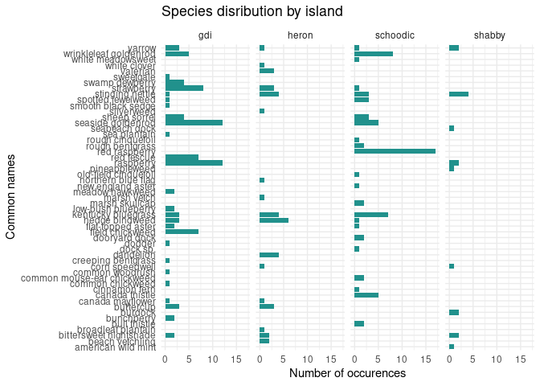

Data analysis
================
Ellie and Finn

``` r
library(tidyverse)
library(broom)
```

    ## Rows: 339 Columns: 10
    ## ── Column specification ────────────────────────────────────────────────────────
    ## Delimiter: ","
    ## chr (8): location, collected by, date, gps, common, spp_code, spp, notes
    ## dbl (2): cover, height
    ## 
    ## ℹ Use `spec()` to retrieve the full column specification for this data.
    ## ℹ Specify the column types or set `show_col_types = FALSE` to quiet this message.

``` r
island_veg <- island_veg %>%
  mutate(location = case_when(
    location == "Schoodic" ~ "schoodic",
    location == "GDI" ~ "gdi",
    TRUE ~ location
  ))
```

``` r
island_veg %>%
  filter(common != "unknown") %>% #filtering out all of the unknown species
  ggplot(mapping = aes(y = common)
    ) +
  geom_bar(fill = "#21918c") +
  facet_wrap(~location, nrow = 1) +
  theme_minimal() +
  labs(title = "Species disribution by island",
       x = "Number of individuals",
       y = "Common names")
```

<!-- -->

``` r
island_veg %>%
  mutate(height_class = case_when(TRUE ~ as.factor(height))) %>% #making height class a factor variable in order to use it in a bar chart
  ggplot(mapping = aes(x = location, fill = fct_rev(height_class))) + #reversing height class so the tallest appears on top
  geom_bar(position = "fill") +
  scale_fill_viridis_d() +
  labs(title = "Height classes on each island",
       x = "Island",
       y = "Proportion on height class") +
  theme_minimal()
```

<!-- -->
