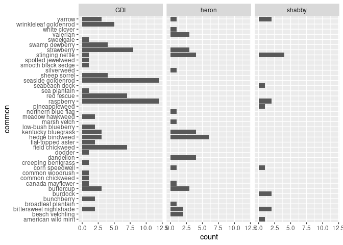
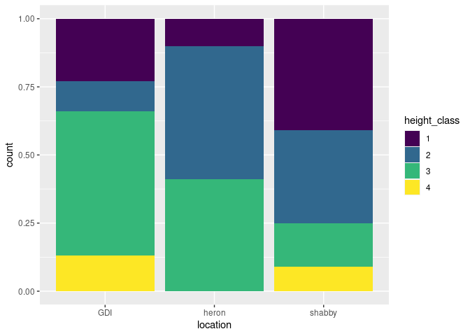

Project proposal
================
Ellie and Finn

``` r
library(tidyverse)
library(broom)
```

## 1. Introduction

In order to better understand the relationship between seabird nesting
sites and plant species and structure, we will use data that Finn
collected from plots on seabird islands in the Gulf of Maine and spatial
data collected by a group of COA students at seabird colonies on those
same islands. Primarily, our project will explore vegetation structure,
species richness, and spatial distribution of vegetation on these colony
islands. We also hope to visualize the relationship between nesting site
choice of different seabird species and plant structure on the islands.
The function of the visualizations we create will primarily be
exploratory, informing further statistical analysis during Finn’s senior
project credits. The question our visualizations will inform is: is
there a relationship between the distribution of plant species and the
distribution of nesting seabirds in the Gulf of Maine?

We hypothesize that bird species may be stratified by vegetation
species, based on the habitat structure that those plants form. Either
this trend will exist and persist across the 4 islands in the study,
supporting a habitat selection hypothesis, or there will be no obvious
trend in the dataset, which would support the null hypothesis: that the
seabirds are not strongly influenced by the vegetation surrounding their
nest.

Finn collected the primary dataset for this project on four seabird
islands (Shabby, Great Duck, Heron, Schoodic Islands) during the summer
of 2023. Seabird nesting data was collected in the same year on the same
islands. The island_veg dataset is stored in an excel file.This data
primarily consists of species ids associated with plot codes. Plot codes
are associated with GPS points in ArcGIS. The island_bird dataset
includes species nesting and a GPS point for each nest. Wriley Hodge was
the primary collector of this dataset. The island_veg dataset includes
ordinal, character, and numeric data while the island_bird dataset
includes spatial data associated with character data.

The Gulf of Maine is an important region for sensitive seabird
populations. In the face of rapid climate change, understanding the
ecology of seabird nesting sites may help us develop effective
conservation strategies.

Spatial data – gps points of veg plots and nests Categorical – bird
species, plant species Ordinal – plant height classes, cover classes

## 2. Data

Vegatation data from the seabird islands (Schoodic Island data not
included in the rough dataset):

    ## Rows: 234 Columns: 10
    ## ── Column specification ────────────────────────────────────────────────────────
    ## Delimiter: ","
    ## chr (8): location, collected by, date, gps, common, spp_code, spp, notes
    ## dbl (2): cover, height
    ## 
    ## ℹ Use `spec()` to retrieve the full column specification for this data.
    ## ℹ Specify the column types or set `show_col_types = FALSE` to quiet this message.

``` r
glimpse(data.rough)
```

    ## Rows: 234
    ## Columns: 10
    ## $ location       <chr> "heron", "heron", "heron", "heron", "heron", "heron", "…
    ## $ `collected by` <chr> "finn", "finn", "finn", "finn", "finn", "finn", "finn",…
    ## $ date           <chr> "5/27/2023", "5/27/2023", "5/27/2023", "5/27/2023", "5/…
    ## $ gps            <chr> "hrn3114", "hrn2936", "hrn3058", "hrn3058", "hrn3058", …
    ## $ cover          <dbl> 1, 1, 100, 100, 100, 100, 100, 100, 100, 100, 100, 100,…
    ## $ height         <dbl> 1, 1, 2, 2, 2, 2, 2, 2, 2, 2, 2, 2, 2, 2, 2, 2, 2, 2, 2…
    ## $ common         <chr> NA, NA, "valerian", "dandelion", "stinging nettle", "st…
    ## $ spp_code       <chr> NA, NA, "val off", "tar off", "urt dio", "fra vir", "un…
    ## $ spp            <chr> NA, NA, "Valeriana officinalis", "taraxacum officinale"…
    ## $ notes          <chr> "trans 4 -> HERG nest ~3m out of range", "1) HERG nest …

We are in the process of getting the seabird nesting data. We should
have it once the owners of the data return from the Waterbirds
conference in Florida.

## 3. Ethics review

This data was collected under permit from Acadia National Park. It was
collected with as little disruption to the nesting colonies as possible,
over short visits to the islands.

The data that Finn didn’t collect himself is being used with full
permission from the investigators who collected it under ANP permit and
an IACUC.

## 4. Data analysis plan

During this project, we will take on an untidied dataset collected in
the field. We will tidy the data to make it useful for analysis while
maintaining the integrity of the data. We will also integrate datasets
in order to compare vegetation and bird data. Our primary goal is to
create spatial representations of the vegetation community structure on
each of these islands. We will represent species richness in bar plots
separated by island and ranked by island size. Once we get access to the
island_bird data set, we will overlay eider, black-backed gull, and
herring gull distribution with the vegetation structure from the
island_veg dataset. Hopefully this will give us an idea whether there is
correlation between seabird nests and vegetation structure.

``` r
data.rough %>%
  filter(common != "unknown") %>%
  ggplot(mapping = aes(y = common)
    ) +
  geom_bar() +
  facet_wrap(~location)
```

<!-- -->

``` r
data.rough %>%
  mutate(height_class = case_when(TRUE ~ as.factor(height))) %>%
  ggplot(mapping = aes(x = location, fill = height_class)) +
  geom_bar(position = "fill") +
  scale_fill_viridis_d()
```

<!-- -->
